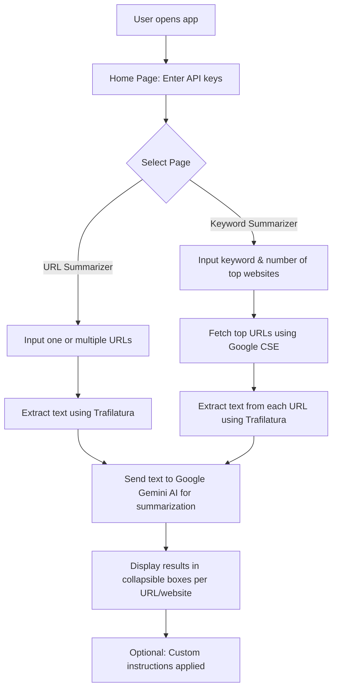

# AI-Powered Web Article Summarizer

## Introduction

The **AI-Powered Web Article Summarizer** is a multi-page Streamlit application designed to automatically extract and summarize text from web articles. Using Google Gemini AI for summarization, the app supports:

* Summarization of **multiple URLs** at once
* Keyword-based summarization of top search results from Google
* Customizable summary types: **concise, detailed, or key points**
* Optional **custom instructions** for the AI model
* Clean and organized UI with collapsible sections for each URL or result

This project is ideal for researchers, students, and professionals who need to quickly digest large amounts of web content.

---

## Features

1. **Home Page for API Setup**

   * Enter and save API keys: Gemini AI key, Google API Key, and Google CSE ID
   * Keys are stored in the session for seamless use across the app

2. **URL Summarization**

   * Enter multiple URLs (one per line)
   * Extracts the main content using Trafilatura
   * Summarizes each URL with the chosen summary type
   * Displays **collapsible sections** for each URL, showing both extracted text and summary

3. **Keyword-Based Summarization**

   * Enter a keyword to fetch the top N websites from Google Custom Search
   * Automatically extracts content from each top website
   * Summarizes using the selected summary type and optional custom instructions
   * Collapsible sections per website for clean viewing

4. **Custom Instructions**

   * Guide the AI on how to summarize, e.g., focusing on key points, tone, or level of detail

---

## How to Use

1. Open the app and go to the **Home** page.
2. Enter your API keys:

   * **Gemini AI API Key**
   * **Google API Key**
   * **Google CSE ID**
3. Choose a page from the sidebar:

   * **URL Summarizer** – Summarize one or more URLs
   * **Keyword Summarizer** – Enter a keyword to summarize top search results
4. Select **summary type**:

   * Concise, Detailed, or Key Points
5. (Optional) Enter **custom instructions** for the AI model.
6. Submit and view results in collapsible sections.

---

## Running Locally

1. **Clone the repository:**

```bash
git clone https://github.com/Lohith-07-coder/Website_Summary.git
cd Web_Summary
```

2. **Create a virtual environment:**

```bash
python -m venv venv
source venv/bin/activate   # Linux/macOS
venv\Scripts\activate      # Windows
```

3. **Install dependencies:**

```bash
pip install -r requirements.txt
```

4. **Run the Streamlit app:**

```bash
streamlit run streamlit_app.py
```

5. Open your browser at `http://localhost:8501`.

---

## Workflow




---

### URL Summarizer Workflow

1. User inputs one or multiple URLs.
2. Trafilatura fetches and extracts the main content from each URL.
3. Text is sent to Google Gemini AI for summarization using the selected summary type and optional custom instructions.
4. Each URL displays a collapsible box containing:

   * Extracted text
   * AI-generated summary

### Keyword Summarizer Workflow

1. User enters a keyword and number of top websites to fetch.
2. Google Custom Search API fetches the top N URLs for the keyword.
3. Each URL’s content is extracted using Trafilatura.
4. The content is summarized via Google Gemini AI, with optional custom instructions.
5. Results are displayed in collapsible sections for each website.

---

## How it Works

1. **Extraction** – Trafilatura scrapes the main text content of webpages while ignoring ads and navigation.
2. **Summarization** – Google Gemini AI generates summaries. Users can control style via summary type or custom instructions.
3. **Keyword Search** – Google Custom Search API fetches top URLs for the provided keyword.
4. **Frontend** – Streamlit provides a multi-page interface with collapsible sections for neat and organized viewing.

---

## Tech Stack

* **Frontend:** Streamlit
* **Backend:** Python modules for extraction, summarization, and API handling
* **Libraries:**

  * `trafilatura` for text extraction
  * `google-generativeai` for summarization
  * `google-api-python-client` for keyword-based search
  * `python-dotenv` for environment variables

---

## Requirements

See `requirements.txt`. Key dependencies:

```text
streamlit
trafilatura
google-generativeai
google-api-python-client
python-dotenv
```

---

## Notes

* Make sure your Google CSE and API key are correctly set up for keyword-based search.
* Gemini AI API key is required for summarization.
* For large articles, set an appropriate `max_tokens` limit.

---

