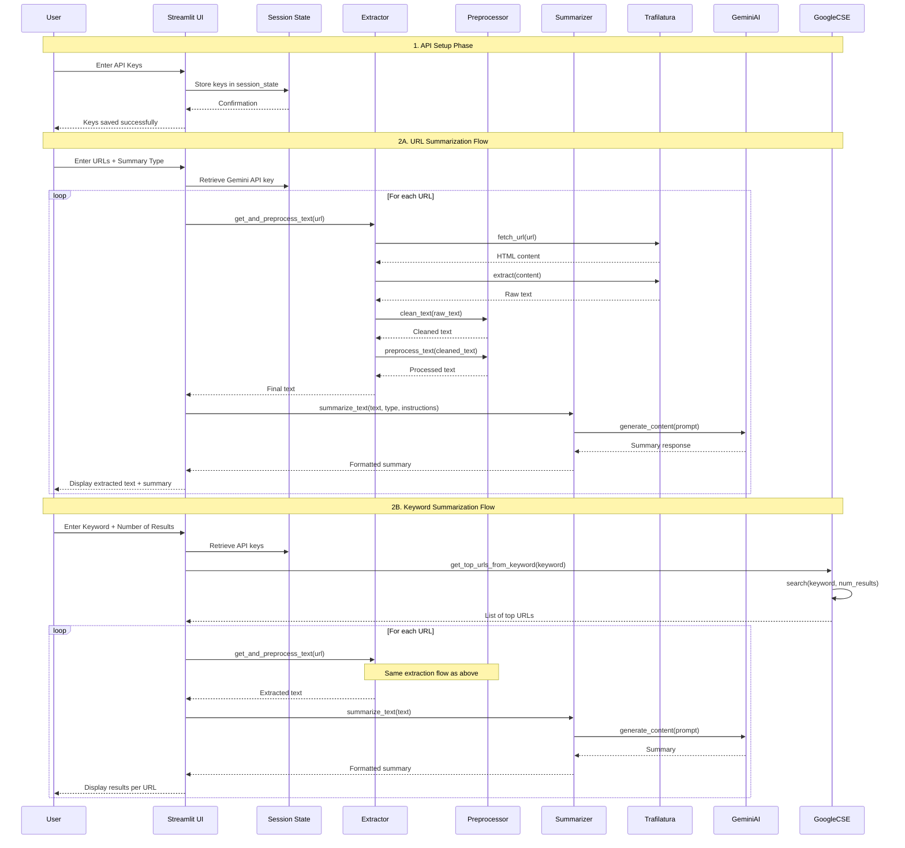
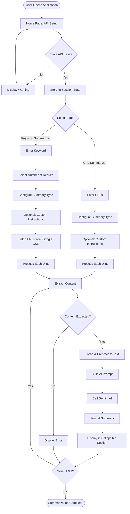

# AI-Powered Web Article Summarizer

## Table of Contents
- [Introduction](#introduction)
- [Features](#features)
- [System Architecture](#system-architecture)
- [Data Flow](#data-flow)
- [Workflow](#workflow)
- [Module Architecture](#module-architecture)
- [API Integration](#api-integration)
- [How to Use](#how-to-use)
- [Running Locally](#running-locally)
- [Configuration](#configuration)
- [Tech Stack](#tech-stack)
- [Security Considerations](#security-considerations)
- [Troubleshooting](#troubleshooting)

---

## Introduction

The **AI-Powered Web Article Summarizer** is a sophisticated multi-page Streamlit application designed to automatically extract and summarize text from web articles. Leveraging Google Gemini AI for intelligent summarization, the app provides:

* **Batch URL Summarization** – Process multiple URLs simultaneously
* **Keyword-Based Discovery** – Automatically find and summarize top search results from Google
* **Flexible Summary Types** – Choose from concise, detailed, or key points formats
* **Custom AI Instructions** – Fine-tune summarization behavior with custom prompts
* **Intuitive UI** – Clean interface with collapsible sections for organized content viewing

This project is ideal for researchers, students, content curators, and professionals who need to efficiently digest large volumes of web content.

---

## Features

### 1. **Home Page for API Setup**
   * Secure API key management with session-based storage
   * Support for multiple API providers:
     - Gemini AI API key for summarization
     - Google API Key for search integration
     - Google CSE ID for custom search engine
   * Keys stored in session state for seamless cross-page access

### 2. **URL Summarization**
   * Batch processing of multiple URLs (one per line)
   * Intelligent content extraction using Trafilatura
   * Configurable summary types for each URL
   * Real-time processing with progress indicators
   * Collapsible sections displaying both extracted text and summaries

### 3. **Keyword-Based Summarization**
   * Dynamic search result retrieval via Google Custom Search
   * Configurable number of top websites (1-10)
   * Automatic content extraction from search results
   * Batch summarization with consistent formatting
   * Organized display with per-website collapsible sections

### 4. **Custom Instructions**
   * Natural language guidance for AI summarization
   * Control over tone, focus areas, and detail level
   * Applied consistently across all processed content

---

## System Architecture

The application follows a modular architecture with clear separation of concerns:

```
┌─────────────────────────────────────────────────────────────────┐
│                        Streamlit Frontend                        │
│  ┌──────────────┐  ┌──────────────┐  ┌──────────────────────┐  │
│  │  Home Page   │  │ URL Summarizer│  │ Keyword Summarizer   │  │
│  │ (API Setup)  │  │    Page       │  │      Page            │  │
│  └──────┬───────┘  └──────┬───────┘  └──────┬───────────────┘  │
│         │                  │                  │                  │
└─────────┼──────────────────┼──────────────────┼──────────────────┘
          │                  │                  │
          ▼                  ▼                  ▼
┌─────────────────────────────────────────────────────────────────┐
│                     Application Logic Layer                      │
│                                                                  │
│  ┌─────────────────┐  ┌─────────────────┐  ┌────────────────┐ │
│  │    Extractor    │  │   Preprocessor   │  │  Summarizer    │ │
│  │  (extractor.py) │  │(preprocessor.py) │  │(summarizer.py) │ │
│  │                 │  │                  │  │                │ │
│  │ • URL fetching  │  │ • Text cleaning  │  │ • AI prompting │ │
│  │ • Content parse │  │ • Normalization  │  │ • Response     │ │
│  │ • Main text     │  │ • Preprocessing  │  │   handling     │ │
│  │   extraction    │  │                  │  │                │ │
│  └────────┬────────┘  └────────┬─────────┘  └────────┬───────┘ │
│           │                    │                      │         │
└───────────┼────────────────────┼──────────────────────┼─────────┘
            │                    │                      │
            ▼                    ▼                      ▼
┌─────────────────────────────────────────────────────────────────┐
│                     Utility & Support Layer                      │
│                                                                  │
│  ┌─────────────────┐  ┌─────────────────┐  ┌────────────────┐ │
│  │ Keyword Search  │  │   Utilities     │  │  Configuration │ │
│  │(keyword_search) │  │   (utils.py)    │  │   (config.py)  │ │
│  │                 │  │                 │  │                │ │
│  │ • Google CSE    │  │ • Logging setup │  │ • API keys     │ │
│  │ • URL discovery │  │ • File I/O      │  │ • Defaults     │ │
│  │ • Result        │  │ • Timestamps    │  │ • Paths        │ │
│  │   formatting    │  │                 │  │                │ │
│  └────────┬────────┘  └────────┬────────┘  └────────┬───────┘ │
│           │                    │                     │         │
└───────────┼────────────────────┼─────────────────────┼─────────┘
            │                    │                     │
            ▼                    ▼                     ▼
┌─────────────────────────────────────────────────────────────────┐
│                      External Services                           │
│                                                                  │
│  ┌──────────────────┐  ┌──────────────────┐  ┌──────────────┐ │
│  │  Trafilatura     │  │  Google Gemini   │  │  Google CSE  │ │
│  │  Web Scraping    │  │  AI API          │  │  Search API  │ │
│  └──────────────────┘  └──────────────────┘  └──────────────┘ │
└─────────────────────────────────────────────────────────────────┘
```

### Architecture Components

#### **Frontend Layer (Streamlit)**
- **Home Page**: API key configuration and session management
- **URL Summarizer Page**: Multi-URL batch processing interface
- **Keyword Summarizer Page**: Search-based content discovery interface
- **Session State Management**: Persistent API key storage across pages

#### **Application Logic Layer**
- **Extractor Module**: Handles web content fetching and extraction using Trafilatura
- **Preprocessor Module**: Cleans, normalizes, and prepares text for AI processing
- **Summarizer Module**: Interfaces with Google Gemini AI for intelligent summarization

#### **Utility & Support Layer**
- **Keyword Search**: Google Custom Search Engine integration
- **Utilities**: Logging, file operations, timestamp management
- **Configuration**: Centralized settings and environment management

#### **External Services**
- **Trafilatura**: Robust web scraping and content extraction
- **Google Gemini AI**: Advanced language model for summarization
- **Google Custom Search**: Keyword-based URL discovery

---

## Data Flow

### Complete Request-Response Cycle



### Data Transformation Pipeline

```
┌──────────────────┐
│   Raw Web URL    │
└────────┬─────────┘
         │
         ▼
┌──────────────────┐
│  Trafilatura     │──── Fetches HTML content
│  Fetch & Extract │──── Removes ads, navigation, boilerplate
└────────┬─────────┘──── Extracts main article text
         │
         ▼
┌──────────────────┐
│  Preprocessor    │──── clean_text(): Remove HTML entities
│  Clean Text      │──── Normalize whitespace
└────────┬─────────┘──── Remove control characters
         │
         ▼
┌──────────────────┐
│  Preprocessor    │──── Optional: lowercase conversion
│  Preprocess Text │──── Optional: number removal
└────────┬─────────┘──── Punctuation normalization
         │
         ▼
┌──────────────────┐
│  Summarizer      │──── Build prompt based on summary type
│  Build Prompt    │──── Apply custom instructions
└────────┬─────────┘──── Configure generation parameters
         │
         ▼
┌──────────────────┐
│  Google Gemini   │──── Process with gemini-2.5-flash
│  AI Processing   │──── Temperature: 0.3
└────────┬─────────┘──── Max tokens: 20,000
         │
         ▼
┌──────────────────┐
│  Final Summary   │──── Formatted based on type
│  Output          │──── Ready for display
└──────────────────┘
```

---

## Workflow

### Overall Application Flow



### Detailed URL Summarizer Workflow

1. **Input Collection**
   - User inputs one or multiple URLs (one per line)
   - Selects summary type: concise, detailed, or key_points
   - Optionally provides custom instructions

2. **Content Extraction**
   - Trafilatura fetches HTML content from each URL
   - Extracts main article text, filtering out:
     * Navigation menus
     * Advertisements
     * Sidebars
     * Boilerplate content

3. **Text Processing**
   - `clean_text()`: Removes HTML entities and control characters
   - `preprocess_text()`: Normalizes whitespace and punctuation
   - Optionally converts to lowercase (configurable)

4. **AI Summarization**
   - Constructs prompt based on summary type and custom instructions
   - Sends to Google Gemini AI (gemini-2.5-flash model)
   - Receives structured summary response

5. **Display Results**
   - Each URL gets a collapsible expander section
   - Shows both extracted text and generated summary
   - Maintains clean, organized interface

### Detailed Keyword Summarizer Workflow

1. **Search Configuration**
   - User enters search keyword
   - Specifies number of top websites to fetch (1-10)
   - Selects summary type and optional custom instructions

2. **URL Discovery**
   - Google Custom Search API queries for keyword
   - Retrieves top N URLs based on user specification
   - Validates and formats URL list

3. **Batch Processing**
   - Iterates through each discovered URL
   - Follows same extraction → preprocessing → summarization pipeline
   - Displays results progressively as each URL completes

4. **Result Organization**
   - Each website gets dedicated collapsible section
   - Shows extracted text and summary
   - Numbered for easy reference

---

## Module Architecture

### Detailed Component Breakdown

#### **1. streamlit_app.py (Main Entry Point)**
```python
# Application initialization
- Sets page configuration (title, icon, layout)
- Creates sidebar navigation menu
- Routes to appropriate page based on user selection
- Manages page imports and rendering
```

#### **2. pages/home.py (API Configuration)**
```python
# Handles API key management
- Secure password-type input fields for API keys
- Validates all required keys are provided
- Stores keys in st.session_state for persistence
- Provides user feedback on successful save
```

#### **3. pages/url_summarization.py (URL Processing)**
```python
# URL-based summarization interface
- Multi-line text area for URL input
- Summary type selection dropdown
- Custom instructions text area
- Validates API key presence before processing
- Iterates through URLs with progress indicators
- Displays results in collapsible expanders
```

#### **4. pages/keyword_summarization.py (Keyword Processing)**
```python
# Keyword-based summarization interface
- Keyword text input field
- Number input for result count (1-10)
- Summary type selection
- Custom instructions support
- Integrates with Google Custom Search
- Processes discovered URLs automatically
```

#### **5. modules/extractor.py (Content Extraction)**
```python
# Web content extraction functions
Functions:
- get_and_preprocess_text(url): Main extraction pipeline
  * Fetches URL content via Trafilatura
  * Extracts main text content
  * Applies cleaning and preprocessing
  * Returns processed text or None

- save_extracted_text(text, filename): Persists extracted content
- is_allowed_file(file_name): Validates file extensions
```

#### **6. modules/preprocessor.py (Text Processing)**
```python
# Text cleaning and normalization
Functions:
- clean_text(text): Basic cleaning operations
  * Removes HTML entities (&nbsp;, &amp;, etc.)
  * Normalizes whitespace and newlines
  * Removes control/non-printable characters

- preprocess_text(text, lowercase, remove_numbers): Advanced processing
  * Optional lowercase conversion
  * Optional number removal
  * Punctuation spacing normalization

- basic_preprocess_pipeline(text): Combined pipeline
```

#### **7. modules/summarizer.py (AI Integration)**
```python
# Google Gemini AI integration
Function: summarize_text(text, gemini_api_key, summary_type, custom_instructions)
- Configures Gemini API with user's key
- Builds context-aware prompts based on summary type:
  * Short Summary: 3-4 sentence concise summary
  * Detailed Summary: Paragraph-wise detailed analysis
  * Bullet Points: Structured key points format
- Applies custom instructions when provided
- Handles API errors gracefully
- Returns formatted summary text
```

#### **8. keyword_search.py (Search Integration)**
```python
# Google Custom Search Engine integration
Function: get_top_urls_from_keyword(keyword, api_key, cse_id, num_results)
- Builds Google Custom Search service
- Executes search query with specified parameters
- Extracts URLs from search results
- Returns list of top N URLs
- Handles API errors and empty results
```

#### **9. modules/utils.py (Utility Functions)**
```python
# Support utilities
Functions:
- setup_logging(): Configures application-wide logging
- timestamp(): Generates formatted timestamps
- save_text_to_file(content, folder, prefix): Generic file saving
- read_text_file(file_path): Safe file reading
- save_extracted_text(text, filename): Specialized text saving
```

#### **10. config.py (Configuration Management)**
```python
# Centralized configuration
Settings:
- API Configuration: Keys, model names
- Default Values: Temperature, max tokens, summary type
- Directory Paths: Logs, documents, outputs
- Model Settings: Embedding model, generation config
- File Validation: Allowed extensions
```

---

## API Integration

### Google Gemini AI (Summarization)

**Purpose**: Generates intelligent summaries using advanced language models

**Configuration**:
```python
Model: gemini-2.5-flash
Temperature: 0.3 (for consistent, focused outputs)
Max Output Tokens: 20,000
```

**Summary Types**:
- **Short Summary**: 3-4 sentences, concise overview
- **Detailed Summary**: Paragraph-wise breakdown with comprehensive coverage
- **Bullet Points**: Structured key points in list format

**Custom Instructions**: Users can provide natural language guidance to control:
- Tone (formal, casual, technical)
- Focus areas (specific topics or sections)
- Detail level
- Output format preferences

### Google Custom Search API (Keyword Discovery)

**Purpose**: Discovers relevant URLs for keyword-based summarization

**Configuration**:
```python
API: Custom Search JSON API v1
Results per query: 1-10 (user configurable)
```

**Process**:
1. User provides search keyword
2. API queries custom search engine
3. Returns top N URLs with metadata
4. URLs passed to extraction pipeline

**Required Credentials**:
- Google API Key
- Custom Search Engine ID (CSE ID)

### Trafilatura (Content Extraction)

**Purpose**: Extracts main content from web pages while filtering noise

**Features**:
- Removes navigation, ads, and boilerplate
- Handles various HTML structures
- Supports multiple languages
- Fast and reliable extraction
- No configuration required

---

## How to Use

### Step-by-Step Guide

#### 1. **Initial Setup**
   - Launch the application
   - Navigate to **Home** page from sidebar
   - Enter required API credentials:
     * **Gemini AI API Key**: For summarization ([Get key](https://makersuite.google.com/app/apikey))
     * **Google API Key**: For search ([Get key](https://console.cloud.google.com/))
     * **Google CSE ID**: Custom Search Engine ID ([Setup CSE](https://programmablesearchengine.google.com/))
   - Click "Save API Keys"
   - Wait for confirmation message

#### 2. **URL Summarization**
   - Select **URL Summarizer** from sidebar
   - Enter URLs in text area (one URL per line)
   - Choose summary type:
     * **concise**: Brief 3-4 sentence overview
     * **detailed**: Comprehensive paragraph-wise summary
     * **key_points**: Structured bullet-point format
   - (Optional) Add custom instructions for AI
   - Click "Summarize URLs"
   - Review results in collapsible sections

#### 3. **Keyword Summarization**
   - Select **Keyword Summarizer** from sidebar
   - Enter search keyword
   - Set number of top websites (1-10)
   - Choose summary type
   - (Optional) Add custom instructions
   - Click "Fetch & Summarize"
   - Review discovered URLs and their summaries

### Usage Tips
- Start with 3-5 URLs for faster processing
- Use custom instructions to focus on specific aspects
- Collapsible sections keep interface clean and organized
- API keys persist throughout session but not between sessions

---

## Running Locally

### Prerequisites
- Python 3.8 or higher
- pip (Python package manager)
- Internet connection for API access

### Installation Steps

1. **Clone the repository:**
   ```bash
   git clone https://github.com/AkshayBasutkar/Web_Summary.git
   cd Web_Summary
   ```

2. **Create a virtual environment:**
   ```bash
   # Linux/macOS
   python -m venv venv
   source venv/bin/activate
   
   # Windows
   python -m venv venv
   venv\Scripts\activate
   ```

3. **Install dependencies:**
   ```bash
   pip install -r requirements.txt
   ```

4. **Run the application:**
   ```bash
   streamlit run streamlit_app.py
   ```

5. **Access the application:**
   - Open your browser
   - Navigate to `http://localhost:8501`
   - Application will load automatically

### Development Mode
For development with auto-reload:
```bash
streamlit run streamlit_app.py --server.runOnSave true
```

---

## Configuration

### Environment Variables (Optional)

Create a `.env` file in the project root for default settings:

```env
# API Keys (if you want defaults)
GEMINI_API_KEY=your_gemini_key_here
GOOGLE_API_KEY=your_google_key_here
GOOGLE_CSE_ID=your_cse_id_here

# Model Configuration
GEMINI_MODEL_NAME=gemini-2.5-flash
EMBEDDING_MODEL=sentence-transformers/all-MiniLM-L6-v2

# Generation Settings
DEFAULT_TEMPERATURE=0.3
DEFAULT_MAX_TOKENS=20000
DEFAULT_SUMMARY_TYPE=concise
```

### config.py Settings

Customize behavior in `config.py`:

```python
# Model Settings
DEFAULT_TEMPERATURE = 0.3      # AI response randomness (0.0-1.0)
DEFAULT_MAX_TOKENS = 20000     # Maximum output length
DEFAULT_SUMMARY_TYPE = 'concise'  # Default summary format

# File Management
ALLOWED_EXTENSIONS = [".pdf", ".txt", ".docx", ".csv", ".md"]

# Directory Structure
LOGS_DIR = "logs"              # Log file location
DOCUMENTS_DIR = "data/documents"  # Extracted text storage
OUTPUTS_DIR = "data/outputs"   # Summary storage
```

---

## Tech Stack

### Core Technologies

**Frontend Framework**
- **Streamlit 1.25.0+**: Modern Python web framework for data applications
  - Built-in session state management
  - Reactive UI updates
  - Multi-page support
  - Collapsible components

**Backend Language**
- **Python 3.8+**: Application logic and data processing

### Key Libraries

**Web Scraping & Extraction**
- **trafilatura 1.6.3+**: High-quality web content extraction
  - Removes boilerplate content
  - Language detection
  - HTML parsing
  - Content cleaning

**AI & Machine Learning**
- **google-generativeai 0.4.1+**: Google Gemini AI integration
  - Advanced language model access
  - Prompt engineering support
  - Response streaming
  - Error handling

**Search Integration**
- **google-api-python-client 2.100.0+**: Google Custom Search API
  - Programmatic search access
  - Result filtering
  - Quota management

**Text Processing**
- **regex 2023.13.1+**: Advanced pattern matching
- **beautifulsoup4 4.12.2+**: HTML parsing (auxiliary)

**Utilities**
- **python-dotenv 1.0.0+**: Environment variable management
- **loguru 0.7.0+**: Enhanced logging capabilities
- **requests 2.31.0+**: HTTP client for web requests

### Development Tools
- Git for version control
- Virtual environments for dependency isolation
- pip for package management

---

## Security Considerations

### API Key Management
- **Session-based storage**: Keys stored in Streamlit session state (temporary)
- **Not persisted**: Keys cleared when browser session ends
- **Password input fields**: Keys hidden during entry
- **No file storage**: Keys never written to disk in plain text

### Best Practices
1. **Never commit API keys** to version control
2. **Use .env files** for local development (add to .gitignore)
3. **Rotate keys regularly** for enhanced security
4. **Monitor API usage** to detect unauthorized access
5. **Use environment variables** in production deployments

### Data Privacy
- **No data storage**: Extracted text and summaries not permanently stored by default
- **Optional file saving**: User-controlled data persistence
- **Session isolation**: Each user session is independent
- **HTTPS recommended**: Use secure connections in production

### API Quotas
- **Google Custom Search**: 100 queries/day (free tier)
- **Gemini AI**: Rate limits apply based on API plan
- **Monitor usage**: Implement error handling for quota exhaustion

---

## Troubleshooting

### Common Issues and Solutions

#### 1. **API Key Not Set Error**
**Symptom**: Warning message "Gemini API key not set"
**Solution**: 
- Navigate to Home page
- Re-enter all API keys
- Click "Save API Keys"
- Return to desired page

#### 2. **Extraction Failed Error**
**Symptom**: "Failed to extract text from URL"
**Possible Causes**:
- URL is inaccessible or blocked
- Website has anti-scraping measures
- Content is behind paywall or login
**Solutions**:
- Verify URL is publicly accessible
- Try different URL from same topic
- Check internet connection

#### 3. **Summarization Failed Error**
**Symptom**: "Summarization failed" message
**Possible Causes**:
- Invalid Gemini API key
- API quota exceeded
- Network connectivity issues
**Solutions**:
- Verify API key is correct and active
- Check API quota in Google Cloud Console
- Wait and retry after some time

#### 4. **No URLs Found for Keyword**
**Symptom**: Empty results from keyword search
**Possible Causes**:
- Invalid Google API credentials
- Incorrect CSE ID
- API quota exceeded
- Keyword has no results
**Solutions**:
- Verify Google API Key and CSE ID
- Check Custom Search Engine configuration
- Try different, more common keywords
- Review API quota limits

#### 5. **Application Not Starting**
**Symptom**: Streamlit fails to launch
**Solutions**:
```bash
# Verify Python version
python --version  # Should be 3.8+

# Reinstall dependencies
pip install --upgrade -r requirements.txt

# Check port availability
netstat -an | grep 8501

# Try different port
streamlit run streamlit_app.py --server.port 8502
```

#### 6. **Slow Processing**
**Symptom**: URLs take long time to process
**Causes**:
- Large articles
- Multiple URLs
- API latency
**Solutions**:
- Process fewer URLs at once (3-5 recommended)
- Choose "concise" summary type for faster results
- Ensure stable internet connection

### Getting Help

**Documentation**: Refer to inline code comments and docstrings
**Issues**: Report bugs on GitHub repository issues page
**API Documentation**:
- [Gemini AI Documentation](https://ai.google.dev/docs)
- [Google Custom Search API](https://developers.google.com/custom-search/v1/overview)
- [Trafilatura Documentation](https://trafilatura.readthedocs.io/)

---

## Requirements

Complete dependency list (see `requirements.txt`):

```text
# Web Framework
streamlit>=1.25.0

# Text Extraction
trafilatura>=1.6.3

# AI Summarization
google-generativeai>=0.4.1

# Google Custom Search
google-api-python-client>=2.100.0

# Environment Management
python-dotenv>=1.0.0

# Text Processing
regex>=2023.13.1

# Logging
loguru>=0.7.0

# HTML Parsing
beautifulsoup4>=4.12.2

# HTTP Requests
requests>=2.31.0
```

---

## Contributing

Contributions are welcome! Please feel free to submit a Pull Request.

---

## License

This project is open source and available under the MIT License.

---

## Acknowledgments

- Google Gemini AI for powerful summarization capabilities
- Trafilatura for reliable content extraction
- Streamlit for intuitive UI framework
- Google Custom Search for keyword discovery

---

## Contact

For questions or feedback, please open an issue on the GitHub repository.

---

**Built with ❤️ using Streamlit and Google Gemini AI**
